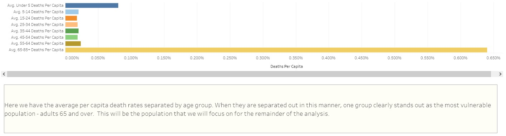
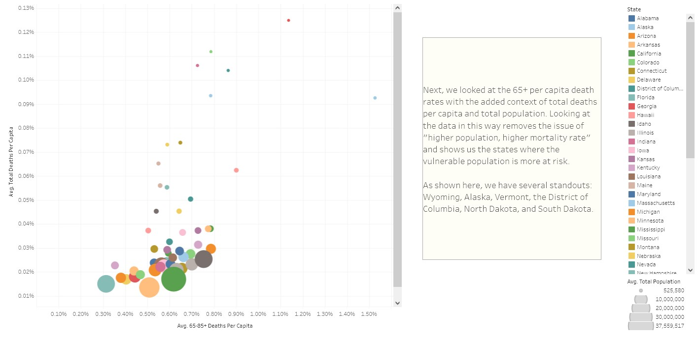
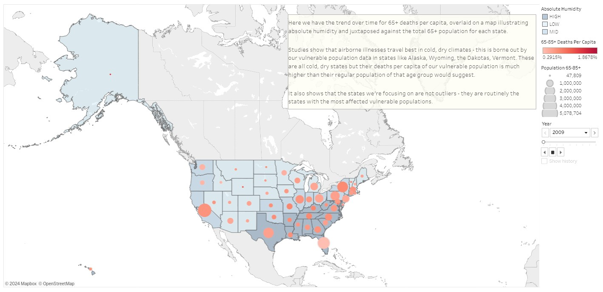

# Medical Staffing Planning Analysis
Geospatial analysis of influenza mortality data over time

# Project Overview
This medical staffing company provides temporary workers to clinics and hospitals on an as-needed basis, and need to have a plan in place for the upcoming influenza season. This will allow them to provide the most assistance where it is most sorely needed.   

## Key Questions & Objectives
Do we need to plan for influenza year-round or seasonally?     
Which states have the largest vulnerable populations, and thus the greater need?    
What other information should be considered when creating our staffing plan?    

### Scope  
The agency covers hospitals and clinics in all 50 states.     
The project is planning for the upcoming influenza season.    
Influenza season is December-March.

## Stakeholders
<ul><b>Hospital Staff:</b> Which hospitals are most likely to see an influx of cases and need assistance serving their communities?</ul> 
<ul><b>Staffing Agency Administrators:</b>  Where can we send our people to do the most good?</ul>
<ul><b>Influenza Patients:</b> Will need care, possibly urgently, and the staffing must be there for them to receive that care.</ul>

# Installation & Setup
## Programs
<ul><b>Analysis Program:</b> Microsoft Excel</ul>
<ul><b>Visualization Program:</b> Tableau </ul>

# Data
## Source Data
CDC influenza deaths        
US Census Bureau population data     
Average state temperatures sourced from Current Results ([fall](https://www.currentresults.com/Weather/US/average-state-temperatures-in-fall.php), [winter](https://www.currentresults.com/Weather/US/average-state-temperatures-in-winter.php), [spring](https://www.currentresults.com/Weather/US/average-state-temperatures-in-spring.php))

# Files Available
Raw Data (CDC influenza deaths, census population)       
Cleaned Data (CDC influenza deaths 2009-2017, census data by county & state 2009-2017, state numerical code reference sheet)      
Transformed & Integrated Dataset (joined with Power Query)      
Statistical Analyses   

# Process & Results
### Prep
After reading through what the stakeholders were looking for and getting an overview of the data, I performed cleaning & standardization on the datasets. This included merging the population data (originally by county) into by-state information, imputing missing values where necessary, and deriving the per capital population death data (to eliminate the "bigger population = more deaths" issue we would otherwise run into).  

### Analysis
To identify the vulnerable populations, I sorted our population into 8 age groups and calculated the per capita deaths per age group. When separated in this way, it became clear that the most vulnerable population that should be focused on was age 65+. Once the vulnerable population was identified, I then investigated the per capita death trend over time to see if there were major changes, and also to see where the vulnerable populations were most affected. Because of their outsize older populations in the winter, I expected to see the largest numbers in states like Arizona and Florida. 

When that wasn't what the data showed, I had to consider what information I was missing, which led me to the weather piece of my analysis. Research shows that airborne illnesses travel best in cold, dry climates, and so I created a table of average humidity level by US state (high, medium, and low) to integrate this weather information into my analysis. I was most interested in looking at how vulnerable populations were faring in states with cold winters and low to medium humidity.

When I added this information, the states where vulnerable populations had an outsize death toll relative to their total population - Alaska, Wyoming, the Dakotas, and Vermont - made more sense. (Both Arizona and Florida are too warm in the winter for ideal influenza transmission.) 

### Recommendations & Next Steps
The conclusion from my analysis showed that the medical staffing agency should focus primarily on Alaska, the Dakotas, Wyoming, and Vermont, with a secondary focus on states that satisfy the "cool, dry climate" ideal transmission conditions for airborne viruses. These are the states with low humidity and flu season temperatures between 30 and 55 degrees Fahrenheit.

My "next steps" recommendations included conducting assessments to uncover regional attitudes toward the flu vaccine, and developing counterarguments to usual protestations around getting the vaccine in order to increase the population willing to get the vaccine.  

### Final Presentation
[Full Tableau Presentation](https://public.tableau.com/app/profile/therightwright/viz/FinalFindings-FluSeason/FinalFindings-FluSeason)   
     

# Acknowledgments/References
Header photo by [CDC](https://unsplash.com/@cdc?utm_content=creditCopyText&utm_medium=referral&utm_source=unsplash) on [Unsplash](https://unsplash.com/photos/person-holding-syringe-and-vial-_zFRhU7jqzc?utm_content=creditCopyText&utm_medium=referral&utm_source=unsplash)                
["Roles of Humidity & Temperature in Shaping Influenza Seasonality"](https://www.ncbi.nlm.nih.gov/pmc/articles/PMC4097773/), Lowen & Steel       
["Investigating the Effects of Absolute Humidity and Movement on COVID-19 Seasonality in the United States"](https://www.nature.com/articles/s41598-022-19898-8), Lin, Hamilton, Gatalo, Haghpanah, Egusa, & Klein (for average humidity levels of US states)
  
  
